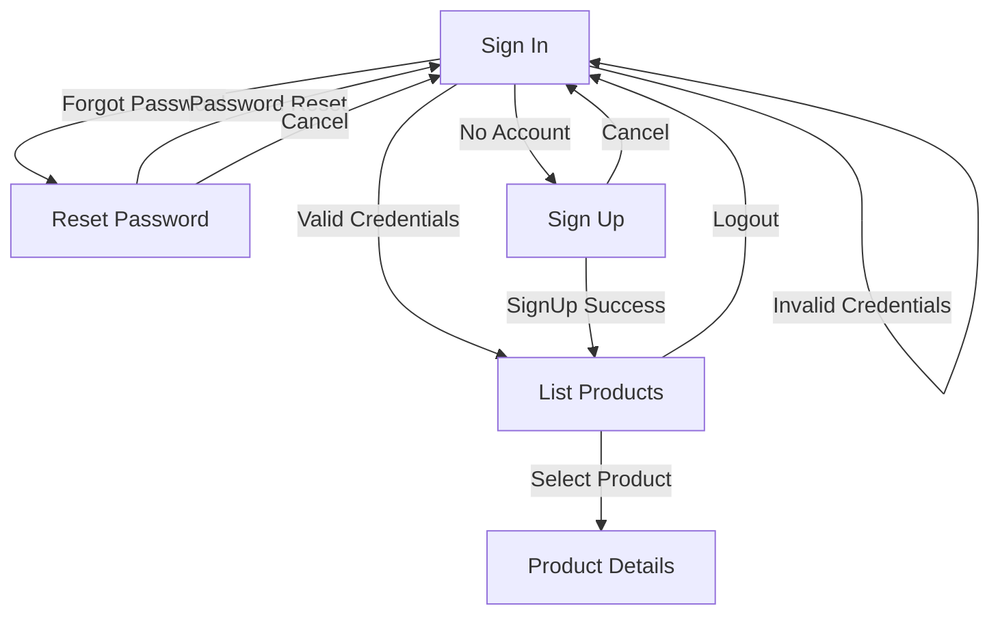
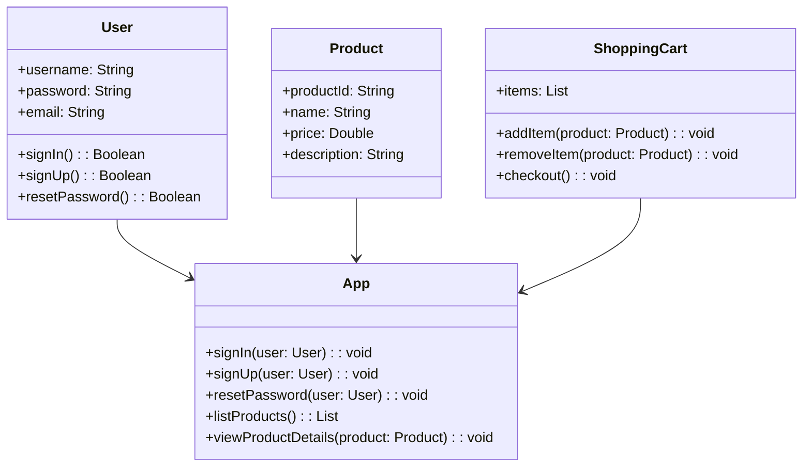
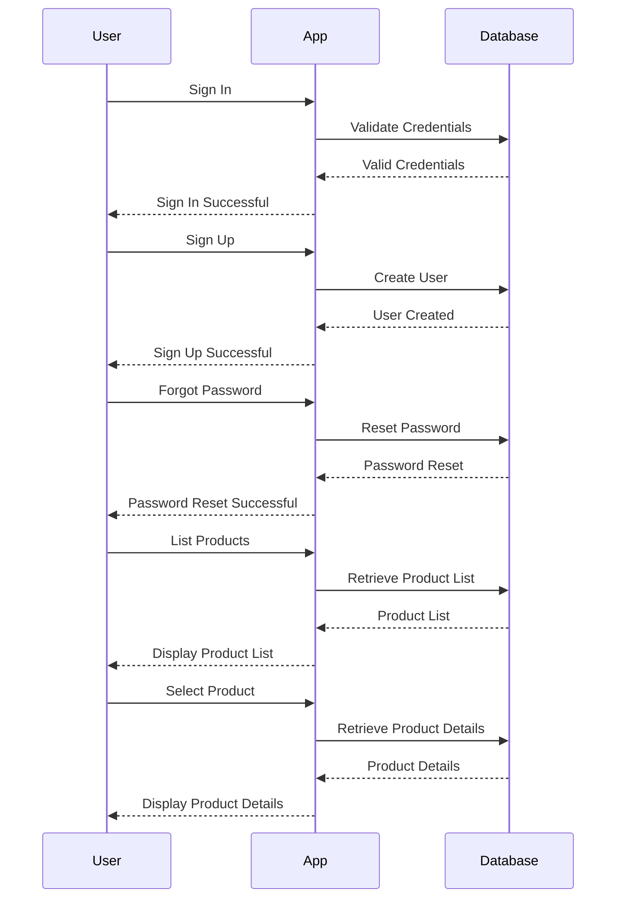
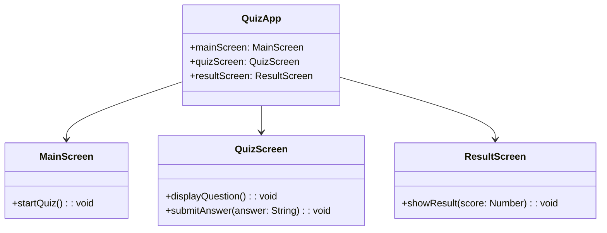
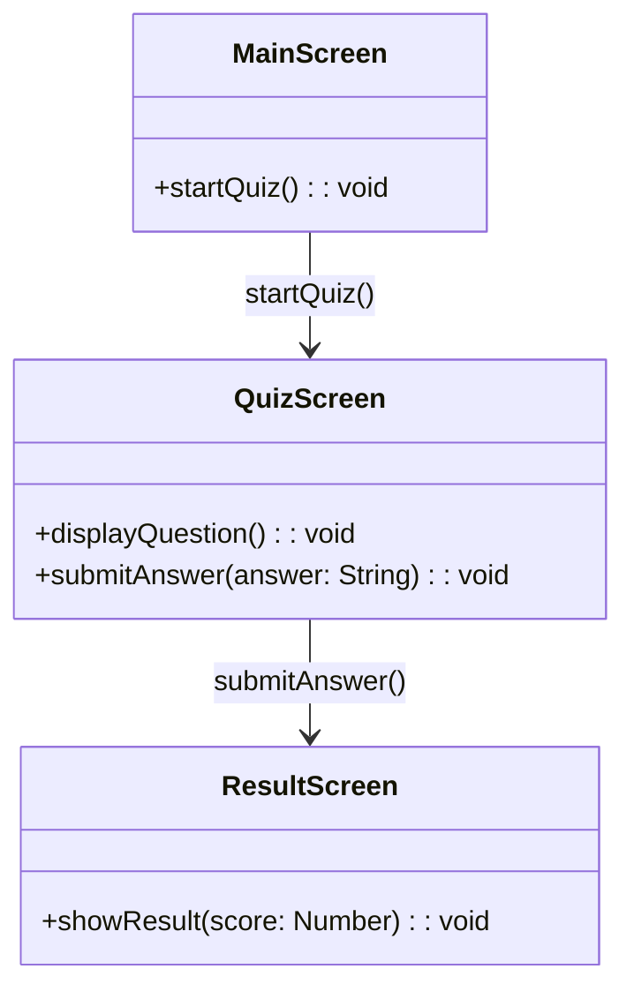
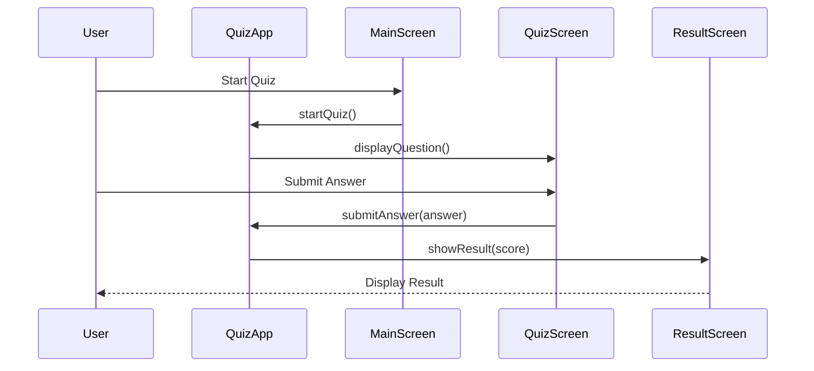

# Android development - Kotlin

Android development - Kotlin

Developed:
- **Dinner decider** app
- **CV Builder** app
  > LinkedIn profile
- **Walmart** clone app
  > Sign in/Sign up/Product list/Product details/Reset password

- **Quiz app** 
  > Full dynamic and single/multi/true false choice

